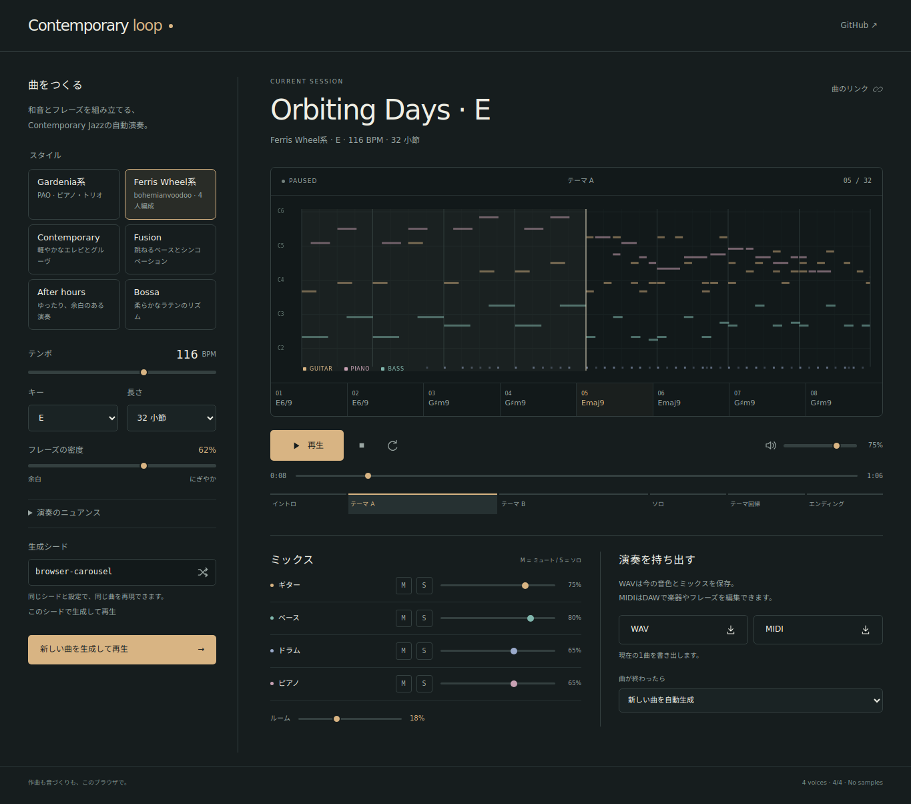

# Contemporary loop

ブラウザの中でContemporary Jazzを自動作曲・演奏するWebアプリ。
エレピ、ベース、ドラム、リードの4パートが、イントロ → テーマ → 対照的なテーマ → ソロ → テーマ回帰 → エンディングを演奏します。

外部の音楽生成API、サンプル音源、アカウント、バックエンドは不要です。音色はWeb Audio APIで合成し、作曲はシード付きのルールベースエンジンで行います。



[スマートフォン表示](docs/mobile.png)

## 起動

Node.js 22以上で、リポジトリのディレクトリから実行します。通常の起動には依存パッケージのインストールは不要です。

```sh
git clone https://github.com/sakusdev/Contemporary-loop.git
cd Contemporary-loop
npm start
```

`http://localhost:4173`を開き、「再生」を押してください。初期設定では曲が終わるたびに次の曲を自動生成します。
ポートを変更する場合は`PORT`環境変数を指定できます。スマートフォンから開く場合は、同じネットワークにあるPCのIPアドレスとポートを使います。

Pythonがある場合は`python -m http.server 4173`でも起動できます。ES Modulesを使用するため、`index.html`の直接ダブルクリックではなくHTTPサーバーで開いてください。

## 機能

- Contemporary / Fusion / After hours / Bossaの4スタイル。
- 12キー、60〜150 BPM、32・64・96小節。密度、スウィング、タイミングのゆらぎを調整。
- モーダルなコード、9th・11th・13thなどのテンション、声部進行を考慮したエレピの配置。
- 短いモチーフの反復・変化、区間ごとの編成の変化、シンコペーション、ベースのアプローチノート、フレーズ末のドラムフィル。
- コード進行とピアノロール表示。コードや構成のボタンから再生位置へ移動。
- パートごとの音量・ミュート・ソロ、全体音量、ルームリバーブ。
- 連続生成／同じ曲をリピート／1曲で停止。
- 再現可能なシードと曲の共有リンク。設定・ミックスは端末内に保存。
- WAV: 44.1 kHz / 16-bit / ステレオ。同じ音源と現在のミックスで1曲全体をオフラインレンダリング。
- MIDI: Type 1、480 PPQ、テンポ・4/4・区間マーカー・コード名・4パート。ミュートと音量を反映。
- 日本語UI、PC・スマートフォン向けレイアウト、キーボード操作。
- HTTPSまたはlocalhostでは初回読み込み後にService Workerが静的ファイルをキャッシュし、オフラインでも再起動可能。

操作対象が入力欄やボタン以外のときは、Spaceキーで再生／一時停止できます。
「生成して再生」は現在の設定とシードを使います。「新しい曲」ボタンは新しいシードを作って再生します。
設定の「未反映」は、現在の曲と入力欄の設定が違うことを示します。生成ボタンを押すと反映されます。

## Cloudflare Workersで公開

`wrangler.json`で、Workersの[Static Assets](https://developers.cloudflare.com/workers/static-assets/)から`dist/`を配信します。
作曲・音源合成・MIDI／WAV書き出しは利用者のブラウザで実行します。Workerのサーバー処理や外部API用のシークレットは不要です。

### GitHub連携で自動デプロイ

Cloudflareダッシュボードの「Workers & Pages」からWorkerを作成し、GitHubの`sakusdev/Contemporary-loop`を接続します。
[Workers Builds](https://developers.cloudflare.com/workers/ci-cd/builds/configuration/)には以下を設定してください。

| 設定 | 値 |
| --- | --- |
| Worker名 | `contemporary-loop`（`wrangler.json`の`name`と一致） |
| リポジトリ | `sakusdev/Contemporary-loop` |
| 本番ブランチ | `main` |
| ルートディレクトリ | 空欄（リポジトリのルート） |
| ビルドコマンド | `npm run build` |
| デプロイコマンド | `npx wrangler deploy` |
| Node.js | 22以上 |

依存パッケージはCloudflareのビルド環境でインストールされます。配信ディレクトリは`wrangler.json`の`assets.directory`に指定済みです。
初回デプロイの成功後は、`main`へのpushで自動更新されます。公開URLはCloudflareが表示する`https://contemporary-loop.<アカウントのサブドメイン>.workers.dev`です。
Worker名を変更する場合は、ダッシュボードと`wrangler.json`の両方を変更してください。

### 手元からデプロイ

```sh
npm ci
npx wrangler login
npm run deploy
```

`npm run deploy`は静的ファイルをビルドしてから公開します。Cloudflareアカウントの認証はWranglerで行います。

### Workersのローカル確認

```sh
npm ci
npm run dev
```

`http://localhost:8787`でWorkersの配信を確認できます。ファイルを編集した後は、`npm run dev`を再実行して`dist/`を更新してください。
認証なしで配信設定とデプロイ用ビルドを確認するには`npm run deploy:check`を実行します。

`npm run build`で作られる`dist/`は、任意の静的ホスティングや自分のWebサーバーでも配信できます。ビルド自体には依存パッケージは不要です。
ルートパスとサブディレクトリの両方に対応しています。キャッシュ対象のファイルを変更したときは`sw.js`内のキャッシュバージョンを更新してください。

## 検証

```sh
npm run check
npm test
```

依存パッケージなしで構文・マニフェストと、作曲／MIDI／Web Audioの18テストを検証します。
Web Audioの単体テストはAPIを模したコンテキストで、接続・エンベロープ・ミュート・停止・中断からの復帰を検証します。

実際のChromiumで画面操作、再生、MIDI再現性、WAV出力・クリッピング・全ミュート時の無音、連続生成、オフライン再読込、PC／スマートフォンのレイアウトを確認するには以下を実行します。

```sh
npm ci
npx playwright install chromium
npm run test:browser
```

ブラウザテストのスクリーンショットは`test-results/`に出力されます。CIはLinux／Windowsの単体テスト、Chromiumのブラウザテスト、Wranglerのデプロイドライランを実行します。

## 構成と設計資料

| ファイル | 役割 |
| --- | --- |
| `src/music.js` | シード付き作曲、和声、フレーズ、ベース、ドラム、曲の構成 |
| `src/audio.js` | ネイティブ音源、先読みスケジューラ、ミキサー、WAVレンダリング |
| `src/midi.js` | 標準MIDIファイルのエンコード |
| `src/app.js` | 日本語UI、再生・生成・共有・書き出し |
| `wrangler.json` | Cloudflare Workersの名前とStatic Assets配信設定 |
| `docs/engine.md` | 作曲・音源の設計、参照した一次資料 |
| `docs/validation.md` | 単体テスト、実ブラウザとWAVの検証結果 |

音色は合成音源です。実際の奏者や録音音源を再現するモデルではありません。MIDIの再生音色はDAWの音源によって変わります。
画面の非表示や端末の省電力制御でブラウザが音声を停止する場合は、アプリに戻って再生してください。ブラウザがタイマーを間引いた場合、過去の音をまとめて発音せず、進んだ位置から演奏を再開します。
